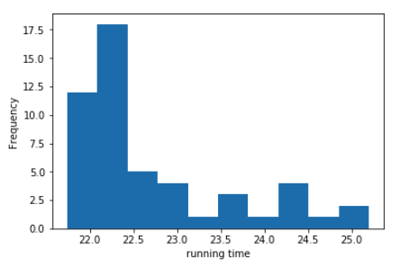
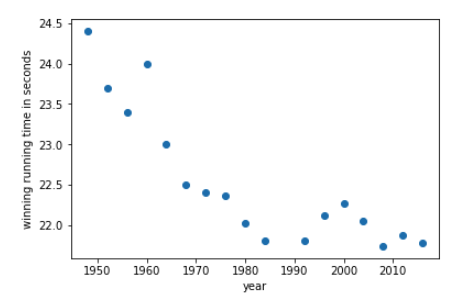

# Challenge

## Get the data

- [x] Read or open the csv. In spreadsheets fix the first row as the header. **How many rows are in the csv?**

Python

- [x] use Pandas to read in the CSV as a dataframe
- [ ] First import libraries:

 ```python
        import pandas as pd
        import matplotlib.pyplot as plt
```

- [x] Then use `pd.read_csv`

_points_: 5

### **Flag 1**

- [x] _flag_: `51`

_flag type_: static

## Average Fastness

- [x] What’s the mean running time across all rows? Enter the number rounded to the precision of 1 decimal place.

_points_: 5

_requirement_: Get the data

### **Flag 2**

- [ ] _flag_: `22.7`

_flag type_: static

## Merlene OTTEY

- [x] Filter to runner with name 'Merlene OTTEY'. What are their fastest and slowest race times? Enter numbers separated by a comma rounded to 1 decimal place. E.g. 10.1,11.1

Python

- If the data frame is called `df` you can filter it like so `df[df[‘Name’] ==  'Merlene OTTEY']`

_points_: 5

_requirement_: Average Fastness

### **Flag 3**

- [x] _flag_: `\s*22.1\s*,\s*22.2\s*`

_flag type_: regex


## Merlene OTTEY average time

- [x] How many seconds less is Merlene OTTEY’s average race time compared to the average race time for all other runners? The average race time for all other runners should *not* include Merlene's times. Enter the number rounded to 2 decimal places.

Caution: If you’re using a filtered view on a spreadsheet, applying a function on the column applies the function to all rows, even ones not showing.

_points_: 5

_requirement_: Merlene OTTEY

### **Flag 4**

- [x] _flag_: `0.62`

_flag type_: static

## Group by

- [x] Across all years, which nationalities are tied for winning the most medals? We want you to try to use a “group by” operation to group by each nationality and count the number of rows.
- [~] Enter comma separated values of the nationalities, sorted alphabetically, with no space after the comma. E.g. AUS,GBR

Python

- Use `df.groupby`

_points_: 10

_requirement_: Merlene OTTEY average time

### **Flag 5**

- [~] _flag_: `\s*JAM\s*,\s*USA\s*`

_flag type_: regex

## Histogram

- [x] Plot a histogram of the race times. This bins the times and counts the number of values we see in each bin. It should look something like the image attached. Since this is for teaching purposes we’ll take your word for capturing this flag. Once you create the plot use the flag `histobistro`. Why do you think the histogram looks this way?

Python

- You can use `matplotlib.pyplot` directly: `plt.hist(df[‘Result’])`. Or you can call plot on the dataframe which calls `matplotlib` internally: `df.plot(y=’Result’, kind='hist')`.

_points_: 5

_requirement_: Group by

### **Flag 6**

- [x] _flag_: `histobistro`

_flag type_: static

**Attached Image**




## Scatter plot

- [x] Plot winning race time vs year on a scatter plot. The winning race time is the fastest time for that year. You’ll need to use a group by operation to find the winning time for each year, then make a plot with this data. What kind of trend do you see?

It should look something like the image attached. Again we’ll take your word for capturing this flag. Once you create the plot use the flag `varyingvariance`. (5 points)

Python

- [x] Use `df.groupby` first to find the winning times. Then use something like `plt.scatter` to plot winning race time vs year


_points_: 10

_requirement_: Histogram

### **Flag 7**

- [x] _flag_: `varyingvariance`

_flag type_: static



